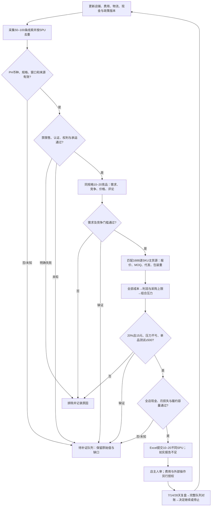

# 证据、门槛与流程

## 硬门槛（除500元等用户约束，其余数字是可校准经营建议）

|维度|必须记录的实际指标|初始判定标准|证据来源/时效|
|---|---|---|---|
|数据质量|国家、币种、SKU、售价条件、销量口径、观测起止、样本时间、估算标记|PH/PHP确认；明确30天窗口；同规格；不含异常或重复计数|官方商品/卖家导出或许可服务；销量窗口结束距今≤14天；证据采集≤7天|
|需求|有效可比样本数、独立店数、窗口销量合计、各店销量|≥10款且≥5店；样本30天销量≥300件；≥3店各≥30件|10–20同规格商品，先排广告、异规格和品牌不可复制款；服务商估算仍标估算|
|竞争|按店聚合CR3、跨境有销量店数、买家到手价P25/P50/P75、近期评论痛点|样本CR3≤70%；≥2跨境店各≥30件/30天；计划到手价≤跨境中位数110%；至少1项经验证差异|CR3是样本集中度；搜索销量榜有选择偏差；平台自营/Choice独立标注|
|趋势|同商品同规格固定样本3期30天销量/销售额；去年同季（如有）|缺少趋势不能称增长爆款；季节品无时机证据暂缓；常青品可按最近有效需求谨慎测试|至少3个不重叠窗口才写趋势；滚动窗口重叠不得算独立样本；累计评论不是销量|
|质量|评分中位数、评论数、20条近期评论的具体问题及链接、样品测试|不编造差评率；重要缺陷不接受；差异点能用样品证明|星级不作销量替代；少于20评论如实记录实际数；样品有测量照片|
|供应|同SKU报价、阶梯、MOQ、单件代发、库存、备货、退换责任|报价/库存24小时内；MOQ兼容单次订单；库存≥10销售单元及已承诺量；备货≤48小时|1688逐SKU详情/用户合法导出及供应商确认；至少1主货源，建议1备用|
|物流|包装重/长宽高、实重与体积重、计费步长、渠道净运费、各段时长|计费重≤500g；国内运费+云仓+包材+净国际物流≤收入25%；24h交运缓冲|SLS本店当期表+云仓合同；备货→国内运输→处理→DTS/到仓扫描截止分别核查|
|利润|成交净收入、全部成本、基准利润率/利润、采购上限、组合压力利润|≥20%且≥15元；压力≥0；报价≤反推上限|参见cost-model；所有未知费用阻断，0必须有不适用/免费依据|
|测试与资金|单品总成本、已花+不可取消+拟新增，全店可用现金与未决损失|单品≤500；应急≥5000；月亏损及新增最坏损失合计≤4000；新增垫资≤净可用资金80%|当天银行/支付/订单余额；测试成本不与预计销售收入抵消|
|合规|平台禁限售、进口/承运、BPS/FDA/NTC适用、品牌/外观/图权|全部明确通过；明确失败拒绝；未知补证|官方当期政策、SKU材料与用途、权利授权；名单检索没命中不等于已完成法律判断|

市场决策表必须分“数值达到”“证据是否有效”。原始样本有20条但币种/窗口错误时，有效样本仍为0，不能给需求通过。

## 每日执行流

## 一款产品的可审核解释

1. **事实**：列有效样本与时间窗、价格分位数、跨境样本、供应商SKU与报价/库存/包装、费用规则。每项带来源定位。
2. **计算**：实际值与阈值、差额、单位、基准/压力、反推采购上限、测试预算和组合资金。
3. **推断**：解释这些数据为何支持“小额测试”；写出竞争优势如何验证，不提供销量成功率。
4. **反证和缺口**：低价本土竞品、运费占比、退款、资质等可能否定结论的证据。
5. **建议**：通过/不通过/待补证；下一项最能改变判断的动作；人工审核人、时间、输入版本。

## 数据源失败

2026-09-15已遇到：Sorftime额度耗尽；历史PH查询的价格字典写THB，多个sales_calc_time=1970-01-01；1688公共网页无法读取且浏览器站点策略禁止访问。不能绕过站点策略或把搜索缓存当当日报价。允许处理用户已取得的逐SKU导出、截图/报价单与官方结算资料。没有新数据时只提交补证状态，不重复通知未变化的故障。
