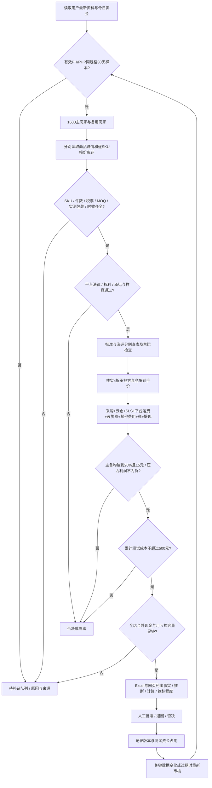

# 本地工作台交付结论

## 核心结论

本地程序和Skill升级已完成并验证；业务选品验收尚未达到“10个以上可做产品”。现有22个候选、2家商家38个SKU，合格数0。未知税费、费率、市场币种/销量窗口和供货实测仍保留为缺口。

## 关键来源与差异

详见工作台“证据与SOP”、Excel第6页及Skill的v2费用规则。采用最新20260908工作簿；海运150g A区85PHP与PDF83.1PHP存在1.9PHP差异，保留原值。云仓2.5元价目与2元算例冲突已记录。设施费豁免不根据未知订单量自动推断。

## 请补充的经营信息

|信息|含义|如何获得|
|---|---|---|
|本店费率|本店适用佣金、交易/支付、活动项目费及收费基数；不再包含另列的平台运费/设施费|中国卖家中心→我的收入→近期完成订单收入详情；无订单则用费率通知与参加项目|
|4折口径|成交价是否为标价40%，折扣是否卖家承担|活动规则及结算说明|
|今日可用余额|现在可以支付采购/云仓/广告的钱|银行和已可提现钱包；未回款订单不算|
|已有承诺|已经必须支付但还未付款的钱|采购单、云仓账单、广告计划；不重复计系统已预留测试额|
|本月已确认损失|已经结清的实际亏损|已成熟订单、广告与退款/COD拒收对账|
|未决损失|尚未结清的退款、拒收等预计损失|逐未决订单估计，未知不能默认为0|
|税费分摊|杭州个体查账征收下合法账务口径的每单成本|纳税身份、出口处理、年度经营所得及会计依据|
|首次上架时间|用于设施费新店90天豁免核实|后台首次成功上架日期|

## 下一步

先在“经营与资金”补表，再配置网站自己的Sorftime密钥。当前对话MCP已取到数据；网站进程需要独立密钥。先完成洗衣袋主备同规格与包装实测，跑通一款可审核样本后再批量扩展。未执行采购、上架、投广告或付费AI生成。
